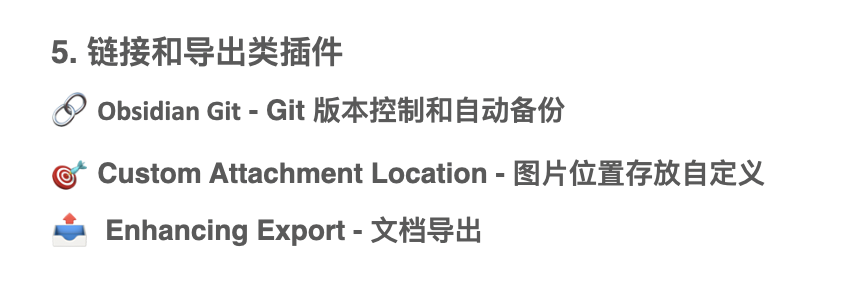

--- 
# 星期一, 三月 02, 2026
< [[2026-03-01|昨日]]
#### 习惯
- [ ] #habit 背单词 (vocabulary::10) 个
- [ ] #habit 吃早饭
- [ ] #habit 运动
- [ ] #habit 睡午觉
#### 方向
指引我前进的 💪
 ![[2026-W09#2026-W09 Goals]]

> [!warning] 创建一个新的每周笔记
> 如果你想创建每周笔记，不要点击上面的链接。 打开命令面板（CTRL/CMD P），选择“Periodic Notes：打开每周笔记”，按照[[目标设置和复习]]中的说明。

#### 今日到期任务

```dataviewjs
dv.taskList(dv.pages().file.tasks 
  .where(t => !t.completed)
  .where(t => t.text.includes("2026-03-02")))
```
#### 今日想要完成任务

#### 工作日志


|     |     |
| --- | --- |
|     |     |
|     |     |


#### 回顾
> [!warning] 吾日三省吾身
> 吃好了吗？ 睡好了吗？ 今天开心吗？
